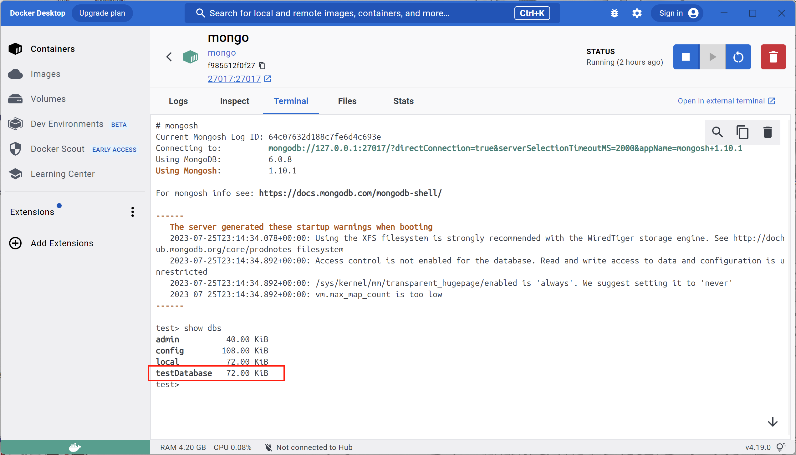
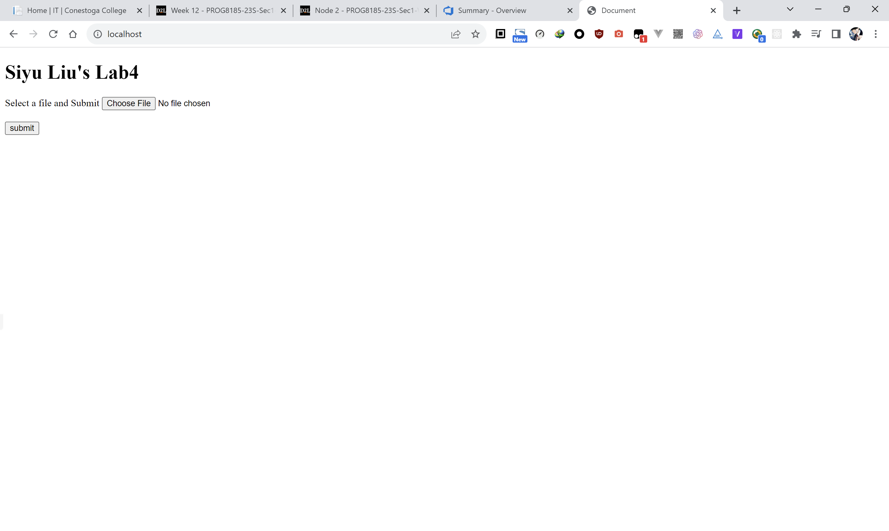
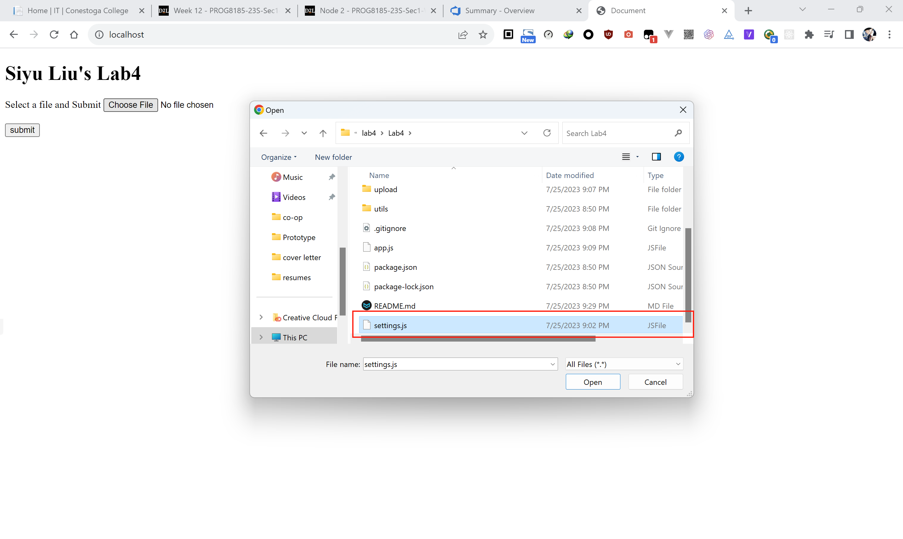
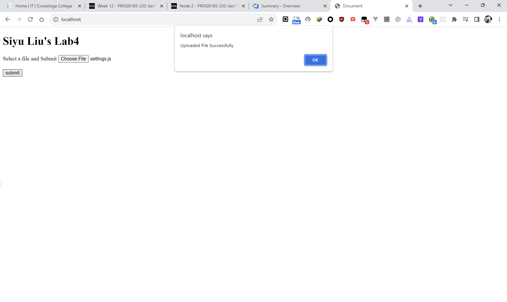
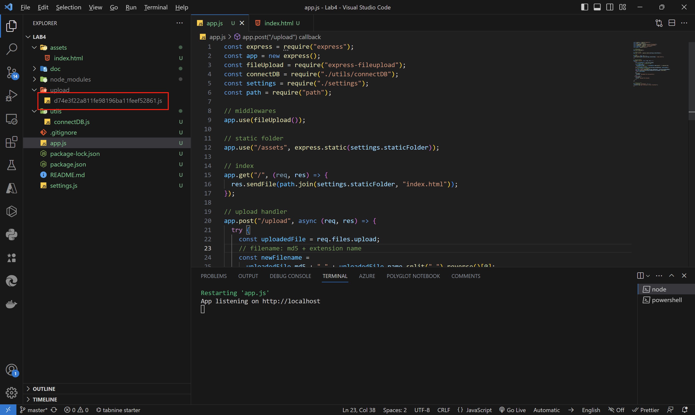
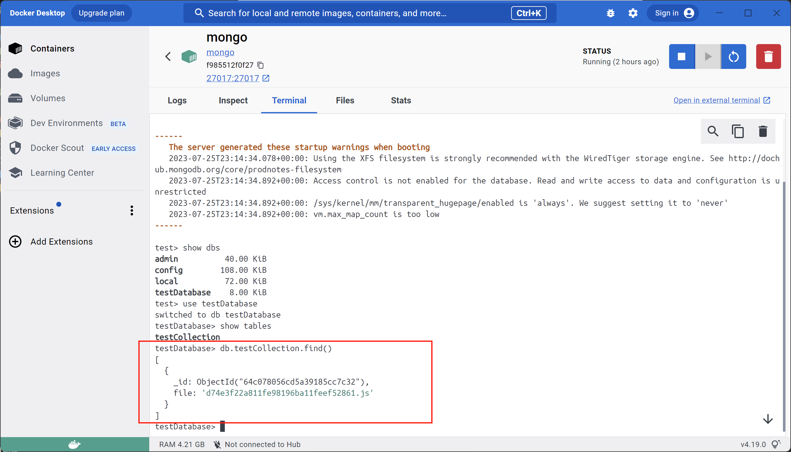

# PROG8185-23S-Sec1-Web-Technologies-Lab4-Express.js-API-Excercise

The lab 4 of Web Technologies is developed by Express.js, it supports to connect MongoDB and upload file via post method.

## Requirements

**Technologies**

- Server: Express/NodeJS

- Client: static Index.html to test file upload 

- Database: Mongoose/Mongo DB

**Create a simple API as in eConestoga documentation for a class**

- Get (s), Post (file upload) and connection to Mongo DB

- Please make sure to commit code/screenshots/scripts to your Azure repo

- Send me an email with azure link. In your email include: section #, the name of everyone in the group and Azure link

## Database Setting

Running on Docker, the database used named as "testDatabase".

## Index.html

## Update File Process

Use settings.js as test file

If submit the file successully, an alert dialog has been displayed.

The uploaded file is renamed and uploaded to target folder

The uploaded file's name is in MongoDB's collection now.

